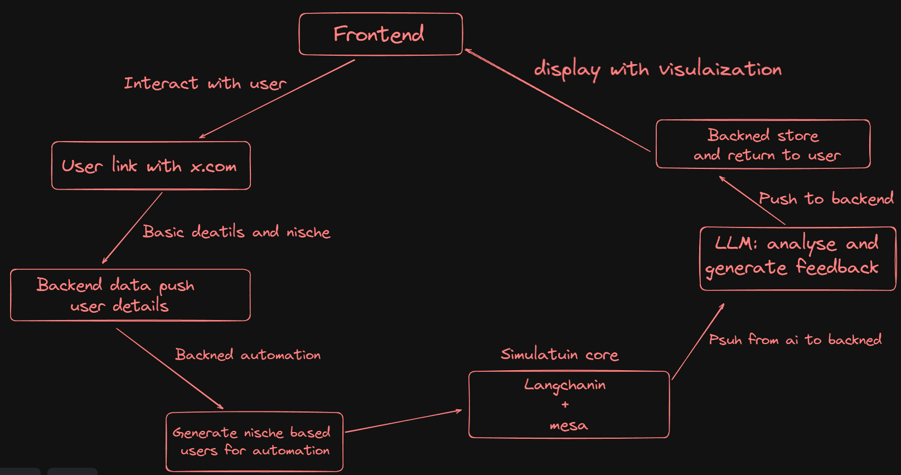

# Sim-Fluence - verify your audiance

<p align="center">
  
</p>

<p align="center"><strong>AI-powered audience simulation to optimize your content before you publish</strong></p>

<p align="center">
  <a href="#features">Features</a> •
  <a href="#demo">Demo</a> •
  <a href="#installation">Installation</a> •
  <a href="#usage">Usage</a> •
  <a href="#architecture">Architecture</a> •
  <a href="#ai-integration">AI Integration</a> •
  <a href="#contributing">Contributing</a> •
  <a href="#security">Security</a> •
  <a href="#license">License</a>
</p>

---

## 🧠 Overview

**Sim-Fluence** is a next-generation content testing platform that leverages agent-based simulation and social graph modeling to forecast how real-world audiences might respond to your content—*before* you share it. Whether you're a marketer, content creator, or business strategist, Sim-Fluence empowers you to optimize your messaging, design for virality, and uncover audience insights through AI-powered simulations.

<p align="center">
  
</p>

## 🌍 Flow diagram



---

## 🚀 Features

### 🎭 Human-Like Agent Simulation
Model thousands of unique AI agents with personalized personas, preferences, and social connections that mimic real audiences.

### 📈 Predictive Virality Analysis
Estimate your content’s potential reach and viral performance using engagement simulations across diverse audience clusters.

### 💬 Realistic AI-Generated Feedback
Get feedback in the form of genuine-like comments, reactions, and suggestions—crafted by simulated agents mirroring your target demographics.

### 🌐 Influence Spread Mapping
Visualize content propagation and peer-to-peer influence through social graph simulations, giving you insight into who shares and why.

---

## 🔗 Demo

Experience Sim-Fluence live: [sim-fluence-demo.vercel.app](https://sim-fluence-demo.vercel.app)

---

## ⚙️ Installation

### Prerequisites

- Node.js (v18+)
- npm or yarn
- Git
- Google API Key for Gemini access

---

### 📦 Frontend Setup

```bash
git clone https://github.com/your-username/sim-fluence.git
cd sim-fluence/Frontend
npm install # or yarn install
```

#### Environment Variables

Create a `.env` file in the `Frontend/` directory with:

```env
NEXT_PUBLIC_API_URL=http://localhost:3001/api
NEXT_PUBLIC_CLERK_PUBLISHABLE_KEY=your_clerk_publishable_key
CLERK_SECRET_KEY=your_clerk_secret_key
GOOGLE_API_KEY=your_google_api_key
```

#### Run the Dev Server

```bash
npm run dev # or yarn dev
```

Open [http://localhost:3000](http://localhost:3000)

---

### 💠 Backend Setup

```bash
cd ../Backend
npm install # or yarn install
```

#### Environment Variables

Create a `.env` file in the `Backend/` directory:

```env
PORT=3001
DATABASE_URL=your_database_connection_string
JWT_SECRET=your_jwt_secret
GOOGLE_API_KEY=your_google_api_key
```

#### Run the Backend Server

```bash
npm run dev # or yarn dev
```

---

## 🧪 Usage

### Creating a Simulation

1. Log in to your Sim-Fluence account
2. Go to **New Simulation**
3. Upload or enter your content
4. Select audience demographics and behavior models
5. Run the simulation
6. Review metrics, feedback, and recommendations

### Understanding Results

- **Engagement Score** – Overall interaction level
- **Virality Potential** – Predicted shareability across networks
- **Sentiment Breakdown** – Agent sentiment toward the content
- **Audience Segments** – Reaction analysis by demographic groups
- **Optimization Suggestions** – Actionable AI-based improvements

---

## 🧱 Architecture

### 🖥️ Frontend
- Next.js
- React
- TypeScript
- Tailwind CSS
- Clerk (authentication)

### ⚙️ Backend
- Node.js + Express
- MongoDB / PostgreSQL
- Google Gemini API (for simulation and analysis)

### 🧰 Infrastructure
- **Frontend Hosting**: Vercel  
- **Backend Deployment**: Railway / Heroku  
- **CI/CD**: GitHub Actions

---

## 🤖 AI Integration

Sim-Fluence leverages **Google Gemini AI** to:

- Craft detailed agent personas with individual biases and behaviors
- Simulate human-like responses across different content types
- Perform granular sentiment and intent analysis
- Identify amplification patterns and niche audience reactions
- Recommend data-driven optimizations

---

## 📁 Project Structure

```
sim-fluence/
├── Frontend/               # Next.js frontend
│   ├── app/                # App routes
│   ├── components/         # UI components
│   ├── lib/                # Utilities
│   └── public/             # Static files
├── Backend/                # Express backend
│   ├── controllers/        # Route handlers
│   ├── models/             # MongoDB/PostgreSQL models
│   ├── routes/             # API endpoints
│   └── services/           # Core business logic
└── docs/                   # Documentation and guides
```

---

## 📡 API Reference

RESTful API documentation available at [api-docs.sim-fluence.com](https://api-docs.sim-fluence.com)

**Key Endpoints:**

- `POST /api/simulations` – Launch a new simulation  
- `GET /api/simulations/:id` – Retrieve simulation output  
- `GET /api/agents` – View agent profiles  
- `POST /api/feedback` – Generate AI-based content feedback

---

## 🤝 Contributing

We welcome developers, researchers, and creators to contribute!

### Development Workflow

1. Fork the repository  
2. Create a feature branch: `git checkout -b feature/your-feature-name`  
3. Commit your changes: `git commit -m "Add: new feature"`  
4. Push your branch: `git push origin feature/your-feature-name`  
5. Submit a pull request 💠

Please refer to our [Contributing Guide](CONTRIBUTING.md) for more details.

---

## 🔒 Security

Your data and privacy are our top priorities. If you discover a vulnerability, please refer to our [Security Policy](SECURITY.md) for responsible disclosure guidelines.

---

## 📜 License

This project is open-source under the MIT License. See [LICENSE](LICENSE) for details.

---

## 📨 Support

For questions, ideas, or assistance, reach out at [soumadityapal@outlook.com](mailto:soumadityapal@outlook.com)

---

## 🙌 Acknowledgements

- [Google Gemini](https://ai.google.dev/gemini-api) – for advanced AI capabilities  
- [Next.js](https://nextjs.org) – for powering our frontend  
- [Clerk](https://clerk.dev) – for seamless authentication  
- **Team Code for Change** – for building this vision into reality

---

<p align="center">Made with ❤️ by Team Code for Change</p>

